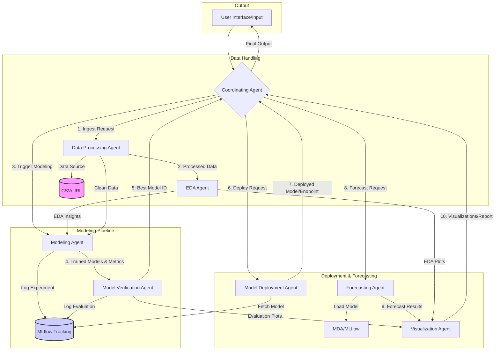

# AFP

# AI Agent-Based Load Forecasting System: Architecture Design

## 1. Overview

This document outlines the proposed system architecture for the AI agent-based load forecasting system. The architecture is designed to be modular, scalable, and adhere to MLOps principles, fulfilling the requirements gathered previously. It leverages multiple specialized AI agents coordinated by a central agent to manage the end-to-end forecasting process, from data ingestion to visualization.

## 2. System Architecture Diagram (Conceptual)

*(Note: This Mermaid diagram provides a high-level overview of agent interactions and data flow.)*

## 3. Agent Roles and Responsibilities

The system comprises the following specialized agents:

1.  **Coordinating Agent:**
    *   **Role:** Acts as the central orchestrator and user interface liaison.
    *   **Responsibilities:** Receives user requests (data source details, forecast parameters like horizon/granularity, target variable), manages the overall workflow by invoking other agents in the correct sequence, maintains the state of the forecasting task, aggregates results, and delivers the final output (forecasts, visualizations, reports) to the user.

2.  **Data Processing Agent:**
    *   **Role:** Handles all aspects of data ingestion and preparation.
    *   **Responsibilities:** Fetches data from user-specified sources (uploaded CSV files, URLs pointing to GitHub/Kaggle datasets), performs initial data validation (checking format, required columns), handles missing values and duplicates, standardizes timestamps (time zone conversion, resampling to required frequency), potentially performs basic feature engineering (e.g., extracting time-based features like hour, day of week), and prepares the data for EDA and modeling.

3.  **EDA Agent (Exploratory Data Analysis):**
    *   **Role:** Analyzes the processed data to uncover patterns and insights.
    *   **Responsibilities:** Calculates descriptive statistics, generates visualizations (time series plots, seasonality decomposition plots, autocorrelation plots, distribution plots), identifies trends, seasonality, outliers, and potential correlations. Provides insights that can inform feature engineering and model selection.

4.  **Modeling Agent:**
    *   **Role:** Trains and tunes various forecasting models.
    *   **Responsibilities:** Receives processed data and potentially features suggested by EDA. Trains a suite of specified models (LSTM, LightGBM, Prophet, AutoTS, Scikit-learn regression models, Statsmodels like ARIMA/SARIMA). Implements hyperparameter tuning strategies (e.g., grid search, random search, Bayesian optimization). Logs experiments, parameters, metrics, and model artifacts to an experiment tracking system (MLflow).

5.  **Model Verification Agent:**
    *   **Role:** Evaluates and compares the performance of trained models.
    *   **Responsibilities:** Takes the trained models from the Modeling Agent. Evaluates them on a held-out test dataset using the user-defined metrics (MAPE, R-squared). Compares model performance, potentially considering factors like training time or complexity alongside accuracy metrics. Selects the best-performing model based on the evaluation results. Logs evaluation metrics to the experiment tracking system (MLflow).

6.  **Model Deployment Agent:**
    *   **Role:** Manages the packaging and serving of the selected model.
    *   **Responsibilities:** Retrieves the best model artifact (identified by the Verification Agent) from the model registry (MLflow). Packages the model for inference. For local deployment, this might involve saving the model in a standard format or potentially setting up a simple local API endpoint (e.g., using Flask/FastAPI) to serve predictions.

7.  **Forecasting Agent:**
    *   **Role:** Generates future load forecasts using the selected model.
    *   **Responsibilities:** Loads the deployed/selected best model. Takes future timestamps or required future features as input. Generates load forecasts for the user-specified horizon and granularity.

8.  **Visualization Agent:**
    *   **Role:** Creates visual representations of data, results, and forecasts.
    *   **Responsibilities:** Generates plots based on EDA findings, model evaluation results (e.g., actual vs. predicted plots, residual plots), and the final forecasts. Can potentially create interactive dashboards (e.g., using Streamlit or Plotly Dash) for easier exploration by the user.

## 4. Data Flow

1.  User provides input (data source, forecast parameters) to the **Coordinating Agent**.
2.  **Coordinating Agent** triggers the **Data Processing Agent**.
3.  **Data Processing Agent** ingests and cleans the data, passing it to the **EDA Agent** and making it available for the **Modeling Agent**.
4.  **EDA Agent** performs analysis and generates insights/visualizations, potentially informing the **Modeling Agent**.
5.  **Coordinating Agent** triggers the **Modeling Agent**, which trains multiple models using the processed data and logs results to MLflow.
6.  **Modeling Agent** passes trained models/metrics to the **Model Verification Agent**.
7.  **Model Verification Agent** evaluates models, selects the best one, logs results to MLflow, and reports the best model choice back to the **Coordinating Agent**.
8.  **Coordinating Agent** triggers the **Model Deployment Agent** to prepare the best model for inference.
9.  **Coordinating Agent** triggers the **Forecasting Agent**, providing necessary context (e.g., future timestamps).
10. **Forecasting Agent** loads the model (via **Model Deployment Agent** or MLflow) and generates forecasts.
11. **Forecasting Agent** passes results to the **Visualization Agent**.
12. **Visualization Agent** also receives inputs from **EDA** and **Model Verification** agents to create comprehensive visuals.
13. **Visualization Agent** passes final visualizations/reports to the **Coordinating Agent**.
14. **Coordinating Agent** presents the final forecasts and visualizations to the user.

## 5. Technology Stack (Proposed)

*   **Programming Language:** Python 3.11
*   **Core Data Handling:** Pandas, NumPy
*   **Machine Learning Models:**
    *   Scikit-learn (for various regression models, preprocessing, metrics)
    *   Statsmodels (for ARIMA, SARIMA)
    *   Prophet (Facebook Prophet)
    *   LightGBM
    *   TensorFlow/Keras or PyTorch (for LSTM)
    *   AutoTS (`auto_ts` or similar libraries)
*   **MLOps & Experiment Tracking:** MLflow (Tracking, Models, Projects)
*   **Data Versioning (Optional but Recommended):** DVC (Data Version Control)
*   **Visualization:** Matplotlib, Seaborn, Plotly
*   **Agent Orchestration:** Custom Python logic within the Coordinating Agent (initially). Frameworks like LangChain or AutoGen could be considered for more complex interactions later.
*   **Local Deployment/UI (Optional):** Flask/FastAPI (for model API endpoint), Streamlit (for a simple interactive UI).
*   **Environment Management:** `venv`

## 6. Scalability and Deployment

*   **Scalability:** The modular agent-based design allows for individual components to be scaled independently if needed in the future (e.g., parallelizing model training, deploying agents as microservices). Using MLflow and potentially DVC supports handling larger datasets and more complex experiment management.
*   **Deployment:** The initial focus is on local development and testing. The architecture allows for packaging the application (e.g., using Docker) for deployment in various environments (on-premise, cloud) later. Model serving can be adapted from local file loading/simple API to more robust cloud-based serving solutions.

This architecture provides a solid foundation for building the requested AI agent-based load forecasting system, balancing flexibility, MLOps best practices, and the specific requirements outlined by the user.
